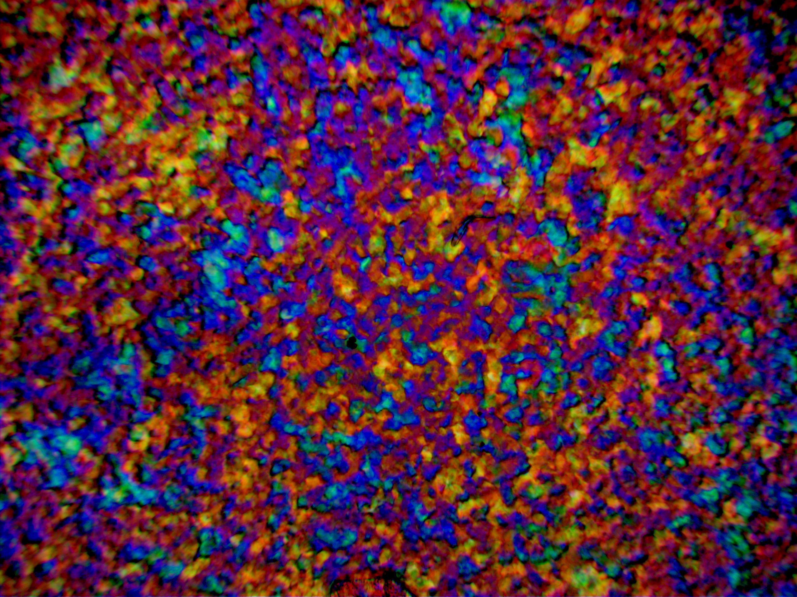

---
title: Self-assembly of cellulose nanocrystals
date: 2021-08-29T16:27:21.435Z
draft: false
featured: false
---

## Brief introduction 
My main focus of my PhD research is understanding the behaviour of rod-shaped nanoparticles called cellulose nanocrystals (CNCs). CNCs spontaneously assemble themselves into complex structures that appear intensely colourful by eye due to light interference. We're interested in this phenomenon because it offers to way to use sustainable materials like cellulose to produce colour.

## Detailed introduction

https://www.ch.cam.ac.uk/group/vignolini/research/cellulose-nanocrystals-self-assembly - I helped to write
