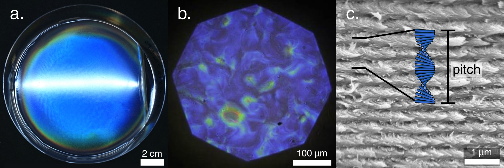

### Brief introduction 
My main focus of my PhD research is understanding the behaviour of rod-shaped nanoparticles called cellulose nanocrystals (CNCs). CNCs spontaneously assemble themselves into complex structures that appear intensely colourful by eye due to light interference. We're interested in this phenomenon because it offers to way to use sustainable materials like cellulose to produce colour. 

I've written a more detailed introduction on the self-assembly of CNCs, which can be seen on the [Bio-inspired Photonics Group website](https://www.ch.cam.ac.uk/group/vignolini/research/cellulose-nanocrystals-self-assembly).

(a) A photograph of a dried CNC film, showing blue structural colour (b) A blue CNC film as seen under an optical microscope using reflected light (c) SEM image of a cross-section of a CNC film, revealing the periodic structure created by the self-assembly process. Reproduced from the [Bio-inspired Photonics Group website](https://www.ch.cam.ac.uk/group/vignolini/research/cellulose-nanocrystals-self-assembly).



### Detailed introduction